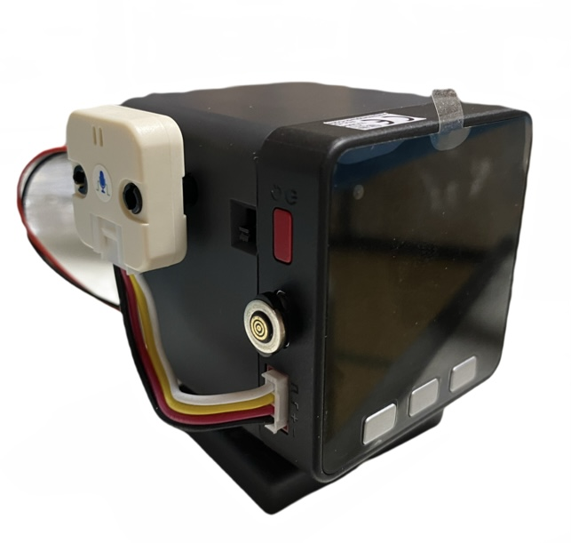

# AI_StackChan2_RT
”ｽﾀｯｸﾁｬﾝ アールティVer.β版”用 AIｽﾀｯｸﾁｬﾝ2です。 
(M5Stack BasicとCore2のみ対応しています。)
  

  

AIｽﾀｯｸﾁｬﾝ2 RTの特徴 

* 音声合成にWeb版 VOICEVOXを使います。
* 音声認識に"Google Cloud STT"か"OpenAI Whisper"のどちらかを選択できます。
 

Google Cloud STTは、”MhageGH”さんの [esp32_CloudSpeech](https://github.com/MhageGH/esp32_CloudSpeech/ "Title") を参考にさせて頂きました。ありがとうございました。 
"OpenAI Whisper"が使えるようにするにあたって、多大なご助言を頂いた”イナバ”さん、”kobatan”さんに感謝致します。 
ウェイクワードには、”MechaUma”さんの[SimpleVox](https://github.com/MechaUma/SimpleVox/ "Title")ライブラリを使わせていただきました。

---

### 必要な物 ###

以下のどちらか。 

* [ｽﾀｯｸﾁｬﾝ アールティVer. β版 (フルキット)](https://www.rt-shop.jp/index.php?main_page=product_info&products_id=4143/ "Title") 
* [ｽﾀｯｸﾁｬﾝ アールティVer. β版 (M5なし)](https://www.rt-shop.jp/index.php?main_page=product_info&products_id=4144/ "Title") 

* M5なしの場合別途、M5Stack BasicかCore2 
* [M5Stack用PDMマイクユニット](https://www.switch-science.com/products/6620?_pos=2&_sid=38aeec5c3&_ss=r/ "Title")（ｽﾀｯｸﾁｬﾝと音声で会話する場合） 
 

### プログラムをビルドするのに必要な物 ###
* VSCode 
* PlatformIO 

使用しているライブラリ等は"platformio.ini"を参照してください。 

---

* 【注意】
ｽﾀｯｸﾁｬﾝと音声で会話する場合は、PORT.Aに[M5Stack用PDMマイクユニット](https://www.switch-science.com/products/6620?_pos=2&_sid=38aeec5c3&_ss=r/ "Title")を接続しておく必要があります。 

---

### 使い方 ###

こちらを参照してください。 

* [AI_StackChan2_RT_README](https://github.com/robo8080/AI_StackChan2_RT_README "Title") 
 
 
 

